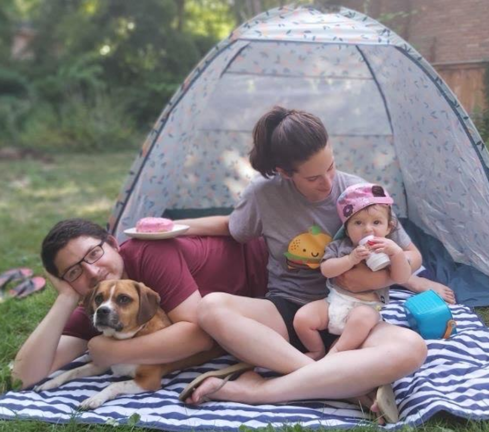
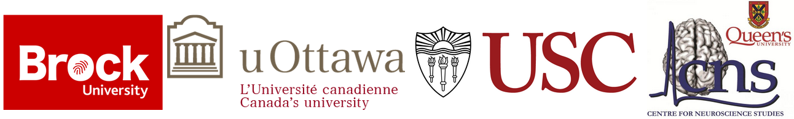
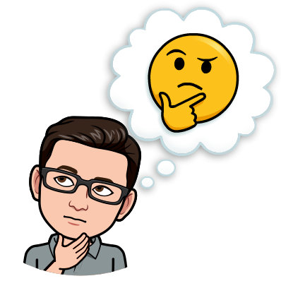
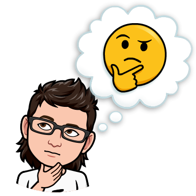

```{r setup, include=FALSE}
options(htmltools.dir.version = FALSE)
```

```{r libraries, echo=FALSE}
library(kableExtra)
library(tidyverse)
```

```{r xaringanExtra, echo=FALSE}
xaringanExtra::use_xaringan_extra(c("clipboard",
                                    "freezeframe",
                                    "panelset",
                                    "scribble",
                                    "tachyons", 
                                    "tile_view"))
```

class: title-slide-section-gold, center, middle

# this course is about...

### how do we *control* motor skills?

### how do we *acquire* motor skills?

---

## What is motor control?

- the study of the **neural, behavioural, environmental, and synergistic** mechanisms responsible for human **movement and stability (posture)**

<ins>Example research questions studied by motor control scientists</ins>:

1. How do our many different systems collectively organize to accomplish a task?

2. How are reflexes involved in the control of movement?

3. How do people maintain their balance when spinning around?

4. How do humans match perceptual information to appropriate motor commands?

5. How and why does alcohol or marijuana affect movement control?

6. Why do most people find it difficult to pat their hand while rubbing their stomach?

---

## What is motor learning?

- the study of the **processes** involved in acquiring motor skills and of the **variables** that **promote *or* inhibit** such acquisition

<ins>Example research questions studied by motor learning scientists</ins>:

1. Are there recognizable stages in the process of skill learning?

2. How frequently should learners be provided with corrective feedback?

3. Is the use of mirrors in teaching skills such as dance effective for learning?

4. Should instructors demonstrate only how to perform skills correctly?

5. How can a therapist or coach estimate a client's potential for (re)learning a skill?

6. Should a performer focus attention on their bodily movement?

---

class: title-slide-section-gold, center, middle

# Meet the Fall 2021 KINESIOL 1E03 team

---

## Your teaching assistants

.pull-left[.center[


.black[Laura St. Germain] | Ph.D Candidate


.black[Ravjot Reshi] | M.Sc. Candidate
]]

.pull-right[.center[


.black[Michelle Mei] | M.Sc. Candidate


.black[Stephanie Mattina] | M.Sc. Student
]]


---

.left-column[


]

.right-column[
## Brad McKay, Ph.D 


___

.black[Memory, Action, & Cognition Lab]
- Metascience
- Motor behaviour
- Research methods and statistics
]

---

.left-column[



]

.right-column[
## Mike Carter, Ph.D 


___

.black[Memory, Action, & Cognition Lab]
- Human-robot and human-human interactions
- The role of feedback characteristics in motor learning
- Metascience and motor learning
- Decision-making for multiple skill/task learning
- Aging, disease, and motor control and learning
]

---

class: inverse, middle, center

# So why study motor control and learning?

---

background-image: url(imgs/challenges-of-control.png)
background-size: contain

.footnote[Source: Wolpert and Bastian 2021]

---

class: inverse, middle, center

## yet, our movements must be...

#### *fast, accurate, smooth*

#### *adaptable/flexible*

#### *relatively "automatic"*

#### *learned*

---

# So why study motor control and learning?

.footnote[Source: https://youtu.be/l9U8X6I1vow?t=43]

.center[
<iframe width="1000" height="465" src="https://www.youtube.com/embed/l9U8X6I1vow?start=43" title="YouTube video player" frameborder="0" allow="accelerometer; autoplay; clipboard-write; encrypted-media; gyroscope; picture-in-picture" allowfullscreen></iframe>
]

---

.center[

]

---

class: title-slide-section-gold, center, middle

# Course outline

---

## Content-based learning objectives

1) Explain the distinction between behaviour that is goal-directed and behaviour that is not goal-directed.

2) Identify and describe different taxonomies used to classify motor skills.

3) List, explain, and calculate common variables used to measure motor performance.

4) Describe sensory systems that support human motor behaviour.

5) Compare and constrast different classes of control.

6) Describe processes underlying motor preparation and factors that influence preparation.

7) Describe and explain the interaction between attention and motor performance.

8) Describe the relationship between speed and accuracy in aiming tasks.

---

## Content-based learning objectives

9) Describe the relationship between speed and accuracy in aiming tasks.

10) Identify and describe different methods to assess motor skill learning.

11) Compare and contrast different models of skill acquisition.

12) Identify, describe, and compare different conditions of practice for learning.

13) Explain why some conditions of practice are more effective than other conditions.

14) Interpret, summarize, and discuss data from common tasks used in the study of motor control and learning.

15) Define metascience and discuss its relevance to motor learning and control research.

---

## Skill-based learning objectives

1) Locate, synthesize, and critically appraise relevant research.

2) Differentiate scientific and non-scientific sources of information.

3) Develop effective strategies to work independently and collaboratively in small teams.

4) Successfully navigate unforeseen challenges as they arise through collaborative problem-solving.

5) Disseminate scientific information and share own ideas through written and oral communication.

6) Apply effective time management techniques to deliver required products on time.

---

## Materials and Fees

### Required Materials / Resources

There is no required textbook for this course. Relevant chapters from the supplemental textbook are included for those interested in additional information beyond that covered in the lectures.

### Supplementary Materials / Resources
Magill, R., & Anderson, D. (2017). *Motor learning and control: Concepts and applications*

- You can access the textbook for free through the McMaster Library

- You will need to login using your MacID and password to access the textbook.

---

## Virtual delivery and course communication

- Zoom will be used for all synchronous lectures. Recurring links will be posted in the General Channel of our course Teams page

- Synchronous lectures will be recorded and then made available through Avenue

- Asynchronous lectures will also be made available through Avenue

- All communication with your TAs and instructors **MUST** be through Microsoft Teams. There will be **NO COMMUNICATION THROUGH EMAIL**

---

## Evaluation

```{r echo=FALSE}
eval <- tibble::tibble(
    c1 = c(
        "Homework Assignments",
        "Project 1",
        "Project 2",
        "Project 3",
        "Total"
    ),
    c2 = c("20%",
           "25%",
           "25%",
           "30%",
           "100%"),
    c3 = c(
        "Fridays by 23:59 EST",
        "Between Sept 27 and Oct 4",
        "Between Nov 8 and Nov 15",
        "Between Nov 29 and Dec 7",
        ""
    )
)

kbl(eval,
    col.names = c("Assessment method",
                  "Weight",
                  "Due date"),
    align = c("l", "l", "l")
) %>%
    kable_paper(c("hover", "condensed", "responsive"), html_font = "Roboto Condensed") %>%
    row_spec(0, bold = TRUE, font_size = 32) %>% 
    row_spec(5, bold = TRUE)
```

---

## Homework assignments

- There are 4 homework assignments

- You can work on these homework assignments with your fellow classmates **but** everyone must submit their own assignment

- A class slot will be provided to work on each homework assignment

- Homework assignments will be posted at the start of the specific class and will be due the next day by 23:59 EST

---

## Projects

- There are 3 projects in this course

- Three project weeks will be provided to facilitate working on and completing the projects

- Each project has a week long submission period that opens the Monday following the project week

- For each project, there are 2 options to choose from. You need to pick and complete only 1 of the options.

- Instructions for each project will be posted on Avenue later today

---

## Various University policies

Be sure to familiarize yourself with the following sections in the course outline:

- Requests for Relief for Missed Academic Term Work
- Academic Accommodation of Students with Disabilities
- Academic Accommodation for Religious, Indigeneous or Spiritual Observances (RISO)
- Courses with an Online Element
- Academic Integrity
- Conduct Expectations
- Copyright and Recording
- Additional Copyright Information
- Extreme Circumstances

---

class: middle

.pull-left[.center[

]]

.pull-right[
<br><br>
> .large[Why do we, and other animals, have brains?]
.tr[
&mdash;*Daniel M. Wolpert, Ph.D*
]

<br>

.center[Watch this video to find out: https://youtu.be/_DdU4ehCzUM]
]

---

class: title-slide-final, middle, center
background-image: url(https://raw.githubusercontent.com/cartermaclab/mackin-xaringan/main/imgs/logos/mcmaster-stack-color.png)
background-size: 95px
background-position: 9% 15%

# What questions do you have?




|                                                                                                                |                                   |
| :------------------------------------------------------------------------------------------------------------- | :-------------------------------- |
| <a href="https://cartermaclab.org">.mackinred[<i class="fa fa-link fa-fw"></i>]                                       | www.cartermaclab.org                        |
| <a href="https://twitter.com/cartermaclab">.mackinred[<i class="fa fa-twitter fa-fw"></i>]                          | @cartermaclab                         |
| <a href="https://github.com/cartermaclab">.mackinred[<i class="fa fa-github fa-fw"></i>]                              | @cartermaclab                           |

---

class: title-slide-final, middle, center
background-image: url(https://raw.githubusercontent.com/cartermaclab/mackin-xaringan/main/imgs/logos/mcmaster-stack-color.png)
background-size: 95px
background-position: 9% 15%

# What questions do you have?




|                                                                                                                |                                   |
| :------------------------------------------------------------------------------------------------------------- | :-------------------------------- |
| <a href="https://cartermaclab.org">.mackinred[<i class="fa fa-link fa-fw"></i>]                                       | www.cartermaclab.org                        |
| <a href="https://twitter.com/cartermaclab">.mackinred[<i class="fa fa-twitter fa-fw"></i>]                          | @cartermaclab                         |
| <a href="https://github.com/cartermaclab">.mackinred[<i class="fa fa-github fa-fw"></i>]                              | @cartermaclab                           |

