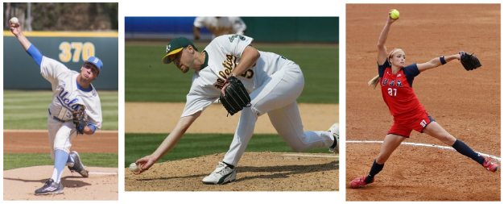
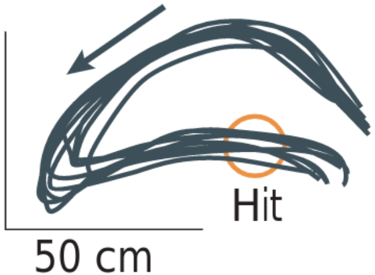
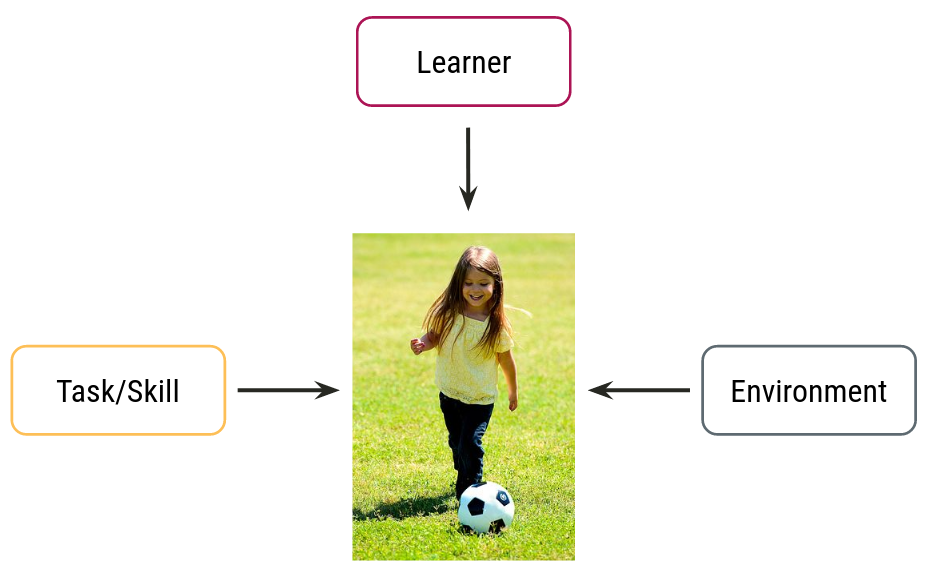
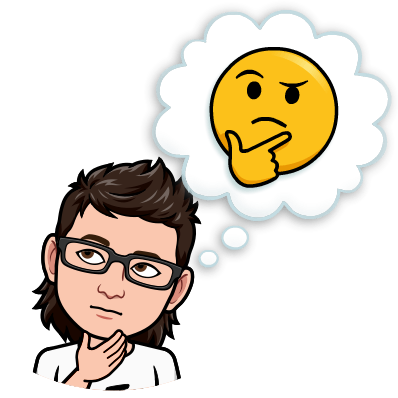

```{r setup, include=FALSE}
options(htmltools.dir.version = FALSE)
```

```{r xaringanExtra, echo=FALSE}
xaringanExtra::use_xaringan_extra(c("clipboard",
                                    "freezeframe",
                                    "panelset",
                                    "scribble",
                                    "tachyons", 
                                    "tile_view"))
```

.pull-left[
> ~~Sept 7 | Welcome~~  
> Sept 9 | Motor skills: Fundamentals

<br>
> Sept 13 | Motor skills: Classification &nbsp;&nbsp;&nbsp;&nbsp;&nbsp;&nbsp;&nbsp;&nbsp;&nbsp;&nbsp;&nbsp;&nbsp;&nbsp;&nbsp;&nbsp;&nbsp;systems  
> Sept 14 | Measurement: Error scores  
> Sept 16 | **HW Assignment 1**

<br>
> Sept 20 | .blue[Project Week]

<br>
> Sept 27 | Measurement: Reaction &nbsp;&nbsp;&nbsp;&nbsp;&nbsp;&nbsp;&nbsp;&nbsp;&nbsp;&nbsp;&nbsp;&nbsp;&nbsp;&nbsp;&nbsp;&nbsp;time  
> Sept 28 | Sensorimotor foundations  
> Sept 30 | Visuomotor foundations

]

.pull-right[
> Oct 4 | Classes of control  
> Oct 5 | Action preparation: &nbsp;&nbsp;&nbsp;&nbsp;&nbsp;&nbsp;&nbsp;&nbsp;&nbsp;&nbsp;&nbsp;&nbsp;Information-processing  
> Oct 7 | **HW Assignment 2**

<br>
> Oct 11 | .black[Reading Week]

<br>
> Oct 18 | Action preparation: &nbsp;&nbsp;&nbsp;&nbsp;&nbsp;&nbsp;&nbsp;&nbsp;&nbsp;&nbsp;&nbsp;&nbsp;&nbsp;&nbsp;Compatibility and complexity  
> Oct 19 | Action execution: Attention &nbsp;&nbsp;&nbsp;&nbsp;&nbsp;&nbsp;&nbsp;&nbsp;&nbsp;&nbsp;&nbsp;&nbsp;&nbsp;&nbsp;and coordination  
> Oct 19 | Action execution: Speed and &nbsp;&nbsp;&nbsp;&nbsp;&nbsp;&nbsp;&nbsp;&nbsp;&nbsp;&nbsp;&nbsp;&nbsp;&nbsp;&nbsp;accuracy 

]

---

## How would you describe these two situations?

.footnote[Left: https://thumbs.gfycat.com/AdoredCarefulCopperbutterfly-size_restricted.gif; Right: https://thumbs.gfycat.com/CheapHardBullfrog-size_restricted.gif]

.pull-left[

]

.pull-right[<br>

]

---

# Learning objectives

1. Define and distinguish the terms **skills/actions**, **abilities**, **movements**, and **reflexes**, and give examples of each.

2. Identify and describe **three influences** on how we perform a motor skill.

3. Define and distinguish **four characteristics** of motor skills.


--

.bg-gold.b--mid-gray.ba.bw2.br3.shadow-5.ph4.mt5[
.tc[
.black[Take-home message:

There are some foundational terms and concepts in the study of motor behaviour that often get used incorrectly in both everyday life and professional sports.
]]]

---

## We can .grey[categorize] skills into one of three domains

.black[COGNITIVE SKILLS]: Depend on an individual's **knowledge and mental abilities**

.black[PERCEPTUAL SKILLS]: Depend on an individual's ability to **recognize and discriminate** among various sources of perceivable stimuli

.black[MOTOR SKILLS]: Depend on an individuals **quality of movement**

--

<br>

.center[
#### *Cognition and perception exist fundamentally to subserve action and are intrinsically linked to the motor system and to the acquisition of skill behaviours*
]

---

## .grey[Motor] skills are...

- goal-directed and performed voluntarily
- require movements of joints and body segments via muscular contractions
- need to be learned (or relearned)

--

### Motor skills vs reflexes
.pull-left[.center[
.black[Wink]

]]

.pull-right[.center[
.black[Blink]

]]


*Winks and blinks are similar **movements** but have very different neuromotor processes*

---

## .grey[Motor] skills are...

- goal-directed and performed voluntarily
- require movements of joints and body segments via muscular contractions
- need to be learned (or relearned)

### Motor skills vs abilities

**Relatively stable and enduring traits** typically regarded as having been either **genetically inherited** or developed during **growth and maturation**

- Abilities are **not** easily modifiable by practice or experience

- Abilities **underlie** motor skills

- E.g., reaction time, hand-eye coordination, dexterity

---

## .grey[Motor] skills are...

- goal-directed and performed voluntarily
- require movements of joints and body segments via muscular contractions
- need to be learned (or relearned)

### Motor skills vs movements

Component parts of a skill that are **observable and measurable**

.center[

]

---

## Why is it important to .grey[distinguish] between motor skills and movements?

.footnote[<sup>1</sup>Will see this in the *Measuring motor performance* lectures]

- Humans learn **motor skills** (i.e., actions), we do not learn movements

- As we learn skills, the movements that make them up become **adaptable** to move successfully in our environment

- Movements and motor skills are **assessed/evaluated/measured** differently<sup>1</sup>
  - **motor skills** are typically evaluated in terms of **outcome**
  
  - **movements** are typically evaluated in terms of how they are **produced**

---

## Characteristics of .grey[skilled performance]

.footnote[<sup>2</sup>Guthrie 1952]

"*the ability to bring about some end result with maximum certainty and minimum outlay of energy, or of time and energy*"<sup>2</sup>

- **Maximum certainty of goal attainment**
  - repeatedly being successful

- **Minimum energy expenditure**
  - decrease physical and mental exertion required

- **Minimum movement time**
  - performance quality remains high with reduced time required to execute it

---

## Four .grey[characteristics] of motor skills

.footnote[Source: https://neurology.mhmedical.com/data/books/1049/kan_ch33_f001.png]

### *Motor equivalence*

.center[

]

---

## Four .grey[characteristics] of motor skills

.footnote[Scott 2004 (https://doi.org/10.1038/nrn1427); Todorov & Jordon 2002 (https://doi.org/10.1038/nn963)]

### *Motor variability*

.center[

]

---

## Four .grey[characteristics] of motor skills

.footnote[Source: https://i.kym-cdn.com/photos/images/original/001/268/638/be0.gif]

### *Motor consistency*

.center[

]

---

## Four .grey[characteristics] of motor skills

.footnote[Source: https://wp.usatodaysports.com/wp-content/uploads/sites/90/2013/08/tiger.gif]

### *Motor modifiability*

.center[

]

---

## The performance of .grey[any motor skill] is influenced by the .grey[individual], the .grey[task], and the .grey[environment]

.center[

]

---

background-image: url(imgs/learner-task-environment-1.png)
background-size: contain

---

background-image: url(imgs/learner-task-environment-2.png)
background-size: contain

---

background-image: url(imgs/learner-task-environment-3.png)
background-size: contain

---

# Learning objectives

1. Define and distinguish the terms **skills/actions**, **abilities**, **movements**, and **reflexes**, and give examples of each.

2. Identify and describe **three influences** on how we perform a motor skill.

3. Define and distinguish **four characteristics** of motor skills.

.bg-gold.b--mid-gray.ba.bw2.br3.shadow-5.ph4.mt5[
.tc[
.black[Take-home message:

There are some foundational terms and concepts in the study of motor behaviour that often get used incorrectly in both everyday life and professional sports.
]]]

---

class: title-slide-final, middle, center
background-image: url(https://raw.githubusercontent.com/cartermaclab/mackin-xaringan/main/imgs/logos/mcmaster-stack-color.png)
background-size: 95px
background-position: 9% 15%

# What questions do you have?




|                                                                                                                |                                   |
| :------------------------------------------------------------------------------------------------------------- | :-------------------------------- |
| <a href="https://cartermaclab.org">.mackinred[<i class="fa fa-link fa-fw"></i>]                                       | www.cartermaclab.org                        |
| <a href="https://twitter.com/cartermaclab">.mackinred[<i class="fa fa-twitter fa-fw"></i>]                          | @cartermaclab                         |
| <a href="https://github.com/cartermaclab">.mackinred[<i class="fa fa-github fa-fw"></i>]                              | @cartermaclab                           |

